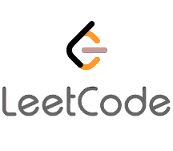
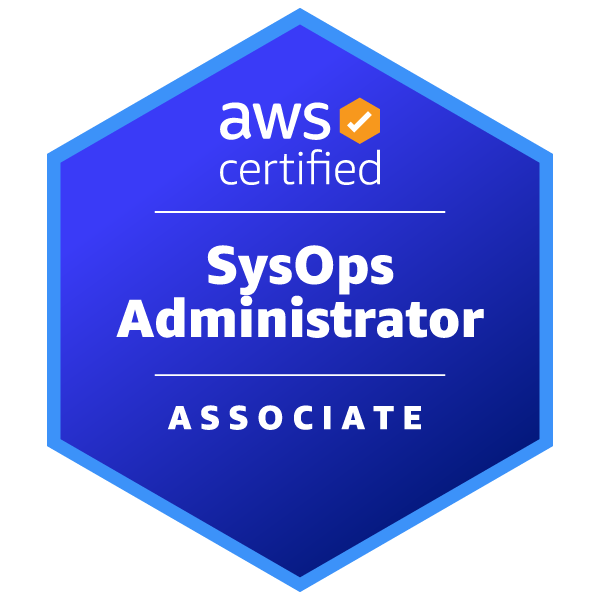

### Hi there 👋!

#### Who I am?
- Tech Lead at  **[PETRONAS ICT SDN BHD](https://en.wikipedia.org/wiki/Petronas), [Malaysia](https://en.wikipedia.org/wiki/Kuala_Lumpur).** 
- Have 8 years of hands-on experience in **software development, team management,** and **tech consultancy.**
- Specialized in builing **Spring Framework, REST API, AWS, Servereless Framework and Single Page App Development**.
- Developed products for **Oil and Gas Industry, News Media industry, IOT & AI based startups** .
- Veteran **competitive programmer** with 6+ years history of participating in national and international online/onsite programming contests and 3+ years experience as **trainer and judge**.
- CEFR Level - C1 English user (IELTS Mode - Academic , Score - 7.00, Date - 28 September, 2019) 
- Enjoy taking certification exams to learn new technology and validate my skill.

#### What I'm doing?
- 🏢 Leading and mentoring a team of 8 engineers to develop a single page application using Spring and ReactJS on AWS.
- 🎩 Responsible for deciding technology choices , ensuring code quality and adopting devops best practices e.g CICD, IAC etc. 
- 👨‍💻 Contributing to development using `Java Spring`, `PostgreSQL`, `Golang`, `ReactJS`.
- 📚 Learning about **kubernetes** while preparing for the CKAD exam.

#### What I like to disscuss about? 
- 💬 Ask me about `Spring` ,`Java`, `Golang`, `SWE`, `REST API`, `Serverless`, `System Design`, `Scalability`, `Design Patterns`, `Data Structures` and `Tech Culture`.

#### What my skill set looks like?
- 🖥 **Front-end:**  🧙🏻‍♂️ `ReactJS` • `👨‍🔧 JavaScript` • `🧚🏻‍♂️ HTML` • `👨🏻‍🎨 CSS`
- 🗄️ **Back-end:**
  - **📜 Languages:** • `🌵 Java` • `🍉 Golang` • `🍎 Python` • `🍓 C#` • `🍇 JavaScript`
  - **🔭 Frameworks:** • `🌱 Spring` • `🌴 Serverless` • `🌷 Pandas` • `🌻 Gin-Gonic`
  - **💾 Databases:** • 🍦 PostgreSQL • 🍧 MongoDB • 🍨 MySQL
- 🎡 **Software development ecosystem:**
  - **📁 Code repository:** • [Git](https://git-scm.com/) • [BitBucket](https://bitbucket.org/product) • [Azure DevOps Server](https://azure.microsoft.com/en-us/services/devops/server/)
  - **🗃 Project management:** • [Jira Scrum Boards](https://www.atlassian.com/software/jira/features/scrum-boards) • [Azure Boards](https://azure.microsoft.com/en-us/services/devops/boards/)
  - **🗂 CI/CD:** • [Azure Pipelines](https://azure.microsoft.com/en-us/services/devops/pipelines/) • [Github Actions](https://github.com/features/actions) 

#### Interested in seeing my github contribution?

&nbsp;
&nbsp;

#### Wanna take a tour at Resume?
- [Resume__Md Najim Ahmed.pdf](https://drive.google.com/file/d/13X-oPu-QogGBYY6Sva4qLWfZ9nKAoCl3/view?usp=sharing)

#### Interested in my competitive programming achievements?

[][codeforces]

[][topcoder]

[][uva]

[][lc]

 
 
 
 
 
 

#### Interested in my Academic/Professional Credentials?
[][acp]

[][saa]

[][dva]

[][soa]

[][ju]

 
 
 
 
 
 

#### How to get in touch with me?

 

 

[acp]: https://www.credly.com/badges/b1282f55-c316-4e7a-bed1-25a7ee6dab79/public_url
[saa]: https://www.credly.com/badges/6fb754a4-c4f3-41f3-922e-7698e0d3feb7/public_url
[dva]: https://www.credly.com/badges/3dd8c804-9037-4c5c-9663-de7a40d10846/public_url
[soa]: https://www.credly.com/badges/f8a71cb7-483f-47d7-b286-2b6c76e5dde9/public_url
[codeforces]: https://codeforces.com/profile/najim4689
[topcoder]: https://www.topcoder.com/members/paranoid.soul
[uva]: https://uhunt.onlinejudge.org/id/72332
[lc]: https://leetcode.com/najim/
[wa]: https://wa.me/8801711927949
[linkedin]: https://www.linkedin.com/in/najim-ahmed-32544b77/
[twitter]: https://twitter.com/najim_ju
[youtube]: https://www.youtube.com/channel/UCHuSJ4mGoDghC-ns7xvrG0A
[email]: mailto:najim.ju@gmail.com
[lichess]: https://lichess.org/@/najim4689
[chessdotcom]: https://www.chess.com/member/najimahmed4689
[ju]: https://www.credly.com/badges/f61261e6-cdc0-4781-98ae-0a74939e6509/public_url