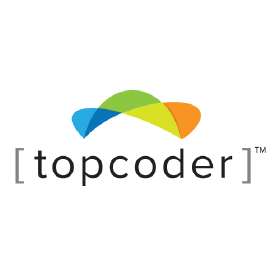
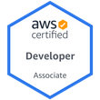

I'm a technical problem-solver, experienced in backend engineering using Java, AWS, SQL and NoSQL databases e.g. PostgreSQL, Redis, MongoDB etc. I thrive in the realm of coding excellence, however, my added year-long expertise in DevOps and Cloud Technology elevates my capability to design and operate systems at a large scale. I deeply care about clean code, design patterns and maturity of tests while developing a solution, and for operations, I follow the 12-factor methodology, leverage cloud services, and maintain a robust DevSecOps pipeline with comprehensive testing and security measures having a "shifting left" automation mindset.

I am also an effective team player, I have led more than 20 engineers across 4 different teams and successfully delivered 10+ projects. My biggest achievement as a team lead is to deliver a product on Java, Postgres, Redis and AWS stack that is used by 40,000 employees of a Fortune 500 company with zero downtime and <150ms p95 response time across 40+ APIs and I have successfully secured highly sensitive personal information of the employees in a way that passed Google Madiant Pen Test, AWS Security Audit and the Company's internal CS Audit.

My primary programming stack is Java and Spring Boot, however, I have also developed solutions on the serverless stack using NodeJS and GoLang. Besides software development, I love to challenge myself to solve algorithmic problems that often require advanced data structures to process a large dataset under strict time constraints. Starting from 2009, I have solved 2000+ problems in 10+ platforms e.g. Topcoder, Codeforces, LeetCode, UVA, URAL, USACO etc and participated in 300+ online competitions and 50+ onsite competitions. You can learn more by following my online profiles below - 

- https://codeforces.com/profile/najim4689
- https://leetcode.com/najim/
- https://profiles.topcoder.com/paranoid.soul
- https://uhunt.onlinejudge.org/id/72332

I also love continuously educating myself by taking online courses from Udemy and doing Certifications. I am currently 4x AWS certified and Kubernetes Certified Application Developer.

Occasionally, I do small fun projects to explore new domains e.g IOT/Machine Learning/Big Data. Here are two of my noteworthy projects - 

# Detect toilet occupancy in real-time
https://github.com/mdnajimahmed/ToiletCubicleSystems

# Control an esp8266 IOT Device with voice command
https://github.com/mdnajimahmed/esp8266-voice-controlled-led

#### Wanna take a tour at Resume?
- [Resume__Md Najim Ahmed.pdf](https://drive.google.com/file/d/1yfPL-n3U8TfIEX63Ef11H0dfevxL5OeS/view?usp=sharing)

#### Interested in my competitive programming achievements?

[][codeforces]

[][topcoder]

[][uva]

[][lc]

 
 
 
 
 
 

#### Interested in my Trainings & Certifications?
[][ckad]
[][soa]
[][dva]
[][saa]
[][acp]
[][ju]

 
 
 
 
 
 

#### How to get in touch with me?

 

 

[acp]: https://www.credly.com/badges/b1282f55-c316-4e7a-bed1-25a7ee6dab79/public_url
[saa]: https://www.credly.com/badges/6fb754a4-c4f3-41f3-922e-7698e0d3feb7/public_url
[dva]: https://www.credly.com/badges/3dd8c804-9037-4c5c-9663-de7a40d10846/public_url
[soa]: https://www.credly.com/badges/f8a71cb7-483f-47d7-b286-2b6c76e5dde9/public_url
[codeforces]: https://codeforces.com/profile/najim4689
[topcoder]: https://www.topcoder.com/members/paranoid.soul
[uva]: https://uhunt.onlinejudge.org/id/72332
[lc]: https://leetcode.com/najim/
[wa]: https://wa.me/8801711927949
[linkedin]: https://www.linkedin.com/in/najim-ahmed-32544b77/
[twitter]: https://twitter.com/najim_ju
[youtube]: https://www.youtube.com/channel/UCHuSJ4mGoDghC-ns7xvrG0A
[email]: mailto:najim.ju@gmail.com
[lichess]: https://lichess.org/@/najim4689
[chessdotcom]: https://www.chess.com/member/najimahmed4689
[ju]: https://www.credly.com/badges/f61261e6-cdc0-4781-98ae-0a74939e6509/public_url
[ckad]: https://www.credly.com/badges/0dc3fc02-71be-47d1-acb1-be23d1beef42/public_url
